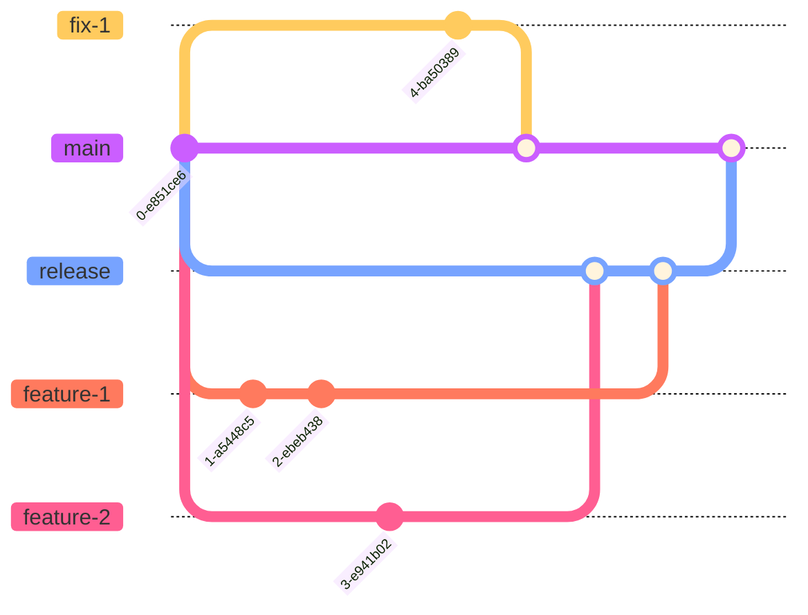

# 0018 - Release & Branch Strategy

* **Status**: accepted

## Context and Problem Statement

Now that the service in in production, the technical team wish to introduce a more structured
way to release new features.

## Decision Drivers

* `dev` environment belongs to developers
  * Deployments to `dev` environment should not feed into formal release pipelines
* Releases should deploy to `test` staging environment, and be tested there, before going to production
* The `main` branch should reflect as closely as possible what is in production

## Considered Options

* GitFlow
* Simple workflow based on GitFlow, with Release branches
* _Status quo_ (pipeline deploys to `dev`, then `test`, then `prod`)

## Decision Outcome

The _status quo_ was rejected as not every `dev` deployment is intended or destined for production.

GitFlow seems over-complex for such a small team of developers.

We elected to deploy from `release` or `fix` branches. Once a `release` or `fix` branch is ready, it
will be deployed to `test`/staging. Once tested there, it will be deployed to `prod`, smoke-tested there
and the `release` branch will then immediately be merged to `main`.

Pull requests will target a `release` branch, not `main`.
